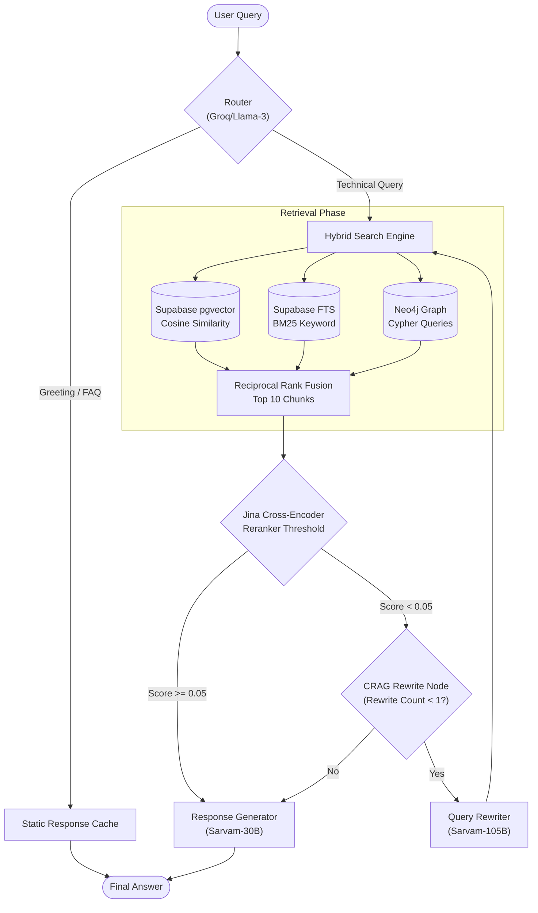

# Multi-Tenant RAG SaaS Platform

This is a Retrieval-Augmented Generation (RAG) platform with strict Multi-Tenancy isolation. It allows users to upload documents and query them using an Agentic LLM workflow.

## Features
- **Multi-Tenant Isolation:** Supabase Row Level Security (RLS) ensures chunks are completely isolated.
- **Hybrid Search (RRF):** Fuses Vector Search (Jina Embeddings in pgvector), Keyword Search (Postgres FTS), and Graph Search (Neo4j Cypher).
- **Agentic Routing:** Uses LangGraph and Groq (`llama-3.1-8b-instant`) to classify user intents (Greeting vs Technical), grade documents, and rewrite bad queries.
- **Generative Chat:** Uses Sarvam-30B to synthesize answers seamlessly.

## Workflow Diagram

## Getting Started

1. Clone the repository.
2. Install dependencies via `uv`.
3. Set up your `.env` file (see `implementation.md` for details).
4. Run the FastAPI server: `uvicorn src.main:app --reload`
5. Visit `http://localhost:8000` to interact with the API or Web UI.

See `implementation.md` for a full breakdown of the architecture and database schema details.
