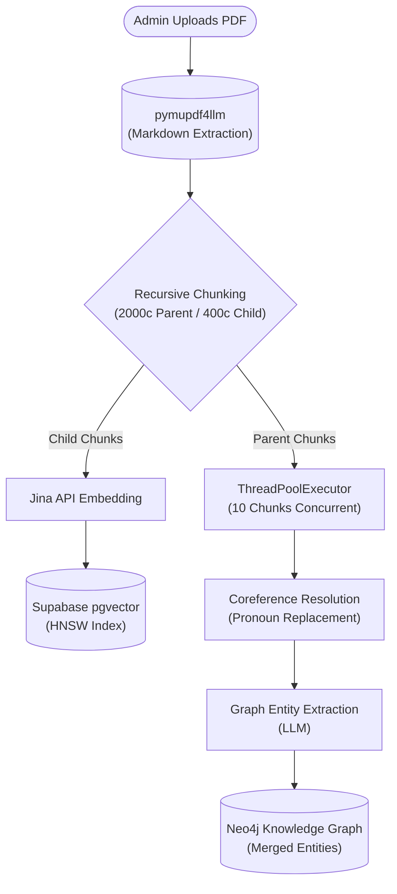

# Multi-Tenant RAG SaaS Platform

This is a Retrieval-Augmented Generation (RAG) platform with strict Multi-Tenancy isolation. It allows users to upload documents and query them using an Agentic LLM workflow.

## Features
- **Multi-Tenant Isolation:** Supabase Row Level Security (RLS) ensures chunks are completely isolated.
- **Hybrid Search (RRF):** Fuses Vector Search (Jina Embeddings in pgvector), Keyword Search (Postgres FTS), and Graph Search (Neo4j Cypher).
- **Agentic Routing:** Uses LangGraph and Groq (`llama-3.1-8b-instant`) to classify user intents (Greeting vs Technical), grade documents, and rewrite bad queries.
- **Generative Chat:** Uses `sarvam-30b` to synthesize answers seamlessly with LangGraph native asynchronous token streaming.

## Workflow Architecture

### Phase 1: Document Ingestion (The Admin Pipeline)



### Phase 2: The Chat Request (The User Pipeline)

```mermaid
graph TD
    Start([User Asks Question]) --> CacheCheck{"Semantic Cache Check<br/>(0ms RAM LRU)"}
    
    %% Cache Hit
    CacheCheck -->|95% Match| StreamCache(["Stream Cached Output"])
    
    %% Cache Miss
    CacheCheck -->|Miss| MemLoad[("Load Stateful Memory<br/>(Preferences & Episodic)")]
    MemLoad --> Contextualize{"Query Contextualization<br/>(Rewrite with Chat History)"}
    
    Contextualize --> Router{"Intelligent Router<br/>(Groq/Llama-3)"}
    
    %% Routing
    Router -->|Greeting / FAQ| StreamGen
    Router -->|Conversational| StreamGen
    Router -->|Technical Query| HybridSearch["Concurrent Hybrid Search"]
    
    %% Retrieval
    subgraph Retrieval Phase
        HybridSearch --> VS[("Supabase Vector<br/>(HNSW)")]
        HybridSearch --> KS[("Supabase Keyword<br/>(BM25)") ]
        HybridSearch --> GS[("Neo4j Graph<br/>(Cypher)")]
        VS & KS & GS --> RRF["Reciprocal Rank Fusion<br/>(Top 5)"]
    end
    
    %% Reranking
    RRF --> Grader{"Jina Cross-Encoder<br/>(Score >= 0.05?)"}
    
    Grader -->|Pass| StreamGen["Response Generator<br/>(gpt-4o-mini SSE Stream)"]
    Grader -->|Fail All| CRAG{"CRAG Rewrite Node<br/>(Rewrite Count < 1?)"}
    
    CRAG -->|Yes| RewriteLLM["Rewrite Query"]
    RewriteLLM --> HybridSearch
    CRAG -->|No| StreamGen
    
    %% Background Extraction
    StreamGen --> Output([Show Output])
    Output -.-> BackgroundExec{{"Background Thread Wakeup"}}
    BackgroundExec --> ExtractFacts["Extract User Facts & Preferences"]
    BackgroundExec --> UpdateGraph["Update Neo4j (User) Node"]
    BackgroundExec --> DistillMem["Distill Episodic Memory"]
```

### Step-by-Step Flow

#### Phase 1: Document Ingestion (The Admin Pipeline)
1. **Text Extraction:** `pymupdf4llm` converts the raw PDF into structured Markdown.
2. **Recursive Parent-Child Chunking:** Markdown is sliced into 400-character "Child" chunks (for precise vectors) and 2,000-character "Parent" chunks (for LLM context).
3. **Concurrent Vectorization:** Child chunks are converted into 1536-dimensional vectors via Jina API and saved to Supabase using an **HNSW index** for sub-millisecond searching.
4. **Graph Extraction:** A background `ThreadPoolExecutor` grabs 10 Parent chunks at a time. It performs **Coreference Resolution** (replacing pronouns) and extracts Graph Entities/Relationships, safely merging them into Neo4j.

#### Phase 2: The Chat Request (The User Pipeline)
1. **Exact-Match Semantic Cache (`check_cache`):** The system securely checks the query against past queries using a blazing-fast RAM `LRUCache`. A 95% match instantly streams the cached answer.
2. **Stateful Memory Injection (`load_memory`):** Fetches the user's Long-Term Memory (Rules/Preferences, Vector Facts, and Episodic chat summaries) and injects it into the LangGraph state.
3. **Query Contextualization (`contextualize_query`):** Rewrites follow-up questions using short-term chat history into standalone queries.
4. **Intelligent Routing (`route_query`):** Categorizes intent. `Greeting` or `Conversational` intents bypass Vector Search entirely, heading straight to the Generator.
5. **Concurrent Hybrid Retrieval (`retrieve`):** Simultaneously queries Vectors (HNSW), Keywords (BM25), and Knowledge Graph (Neo4j). Fuses results using **Reciprocal Rank Fusion (RRF)**.
6. **Precision Reranking & CRAG (`grade_documents`):** The Top 5 chunks are graded by `jina-reranker-v2`. Any chunk below `0.05` is discarded. If all chunks fail, a CRAG loop rewrites the query and tries again.
7. **Asynchronous Streaming (`generate`):** Validated chunks, preferences, and history are sent to `gpt-4o-mini`. Tokens stream instantly back to the UI via Server-Sent Events (SSE).
8. **Background Extraction (`save_memory`):** After the response, a background thread uses `sarvam-30b` to extract new facts and explicit preferences, dynamically connect the Neo4j `(User)` node, and distill older messages into a rolling summary.

## Frontend UI & Authentication
The platform features a modern React (Vite) frontend, split into two primary interfaces:
- **Company Portal:** Allows authenticated admins to upload new documents (PDFs), monitor ingestion status, view token billing metrics, and execute safe Neo4j Graph Garbage Collection to completely wipe documents from all databases.
- **Employee Portal:** A sleek chat interface where employees can interact with the RAG system. It features Server-Sent Events (SSE) to stream the LangGraph cognitive steps in real-time, providing transparency into the AI's thought process (e.g., "Routing Query", "Retrieving from Vector & Graph").

**Multi-Tenancy with Clerk:**
Authentication is handled via Clerk. When an admin registers a company, their unique Clerk `user_id` (e.g., `user_3FGB...`) acts as the strict `tenant_id` that is mathematically enforced across the Supabase Row Level Security (RLS) policies, the pgvector vector store, and the Neo4j Knowledge Graph. The database schema has been refactored to use native `TEXT` types rather than UUIDs to perfectly synchronize with Clerk's format, ensuring Company A can never access Company B's data.

## Getting Started

1. Clone the repository.
2. Install dependencies via `uv`.
3. Set up your `.env` file (see `implementation.md` for details).
4. Run the FastAPI server: `uvicorn src.main:app --reload`
5. Visit `http://localhost:8000` to interact with the API or Web UI.

See `implementation.md` for a full breakdown of the architecture and database schema details.
