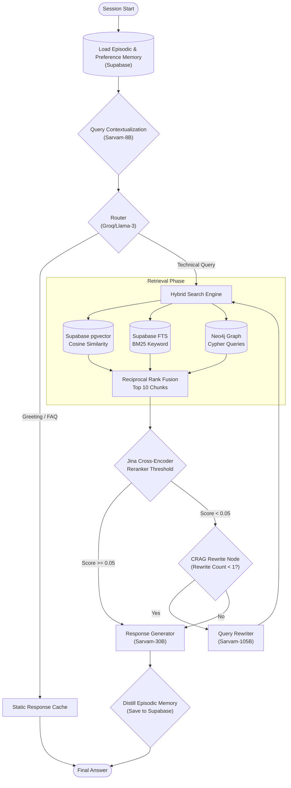

# Multi-Tenant RAG SaaS Platform

This is a Retrieval-Augmented Generation (RAG) platform with strict Multi-Tenancy isolation. It allows users to upload documents and query them using an Agentic LLM workflow.

## Features
- **Multi-Tenant Isolation:** Supabase Row Level Security (RLS) ensures chunks are completely isolated.
- **Hybrid Search (RRF):** Fuses Vector Search (Jina Embeddings in pgvector), Keyword Search (Postgres FTS), and Graph Search (Neo4j Cypher).
- **Agentic Routing:** Uses LangGraph and Groq (`llama-3.1-8b-instant`) to classify user intents (Greeting vs Technical), grade documents, and rewrite bad queries.
- **Generative Chat:** Uses Sarvam-30B to synthesize answers seamlessly.

## Workflow Diagram

### Step-by-Step Architecture Flow

1. **Stateful AI Memory Injection:** Before processing the query, the system fetches the user's `Preference Memory` (rules) and `Episodic Memory` (past conversation summaries) from Supabase and injects them into the LangGraph state.
2. **Contextualization:** If the user asks a follow-up question (e.g., "how do I fix it?"), a lightweight LLM rewrites it into a standalone query using the chat history.
3. **Intent Routing:** A fast LLM (`sarvam-105b` or `llama-3`) classifies the query. Small-talk is routed to a static cache, while actual questions are routed to the retrieval engine.
4. **Hybrid Retrieval:** The system simultaneously queries three databases:
   - **Vector Search** (Cosine similarity via pgvector)
   - **Keyword Search** (BM25 Full Text Search)
   - **Knowledge Graph** (Cypher queries via Neo4j)
5. **Reciprocal Rank Fusion (RRF):** The results from all three databases are mathematically fused together to surface the absolute best chunks, giving a 1.5x score boost to chunks where the search keywords match the Markdown Header.
6. **Cross-Encoder Reranking:** The top 10 chunks are passed to the strict `jina-reranker-v2`. Any chunk that scores below `0.05` is instantly deleted to prevent hallucinations.
7. **Corrective RAG (CRAG) Loop:** If the Reranker deletes *all* the chunks, the system intercepts the failure. Instead of answering "I don't know," an LLM dynamically rewrites the user's query and loops back to Step 4. (This is capped at 1 rewrite attempt to prevent infinite loops).
8. **Generation & Memory Distillation:** The validated chunks are passed to `sarvam-30b` to generate the final answer. In the background, an LLM distills the interaction into a short summary and saves it back to the `episodic_memory` table for the next visit.

### Stateful AI Memory (Handling Session Restarts)
To prevent the LLM's context window from blowing up with massive raw chat logs, the system uses a **Distill & Inject** architecture across session boundaries:
* **Distillation (End of Turn):** After every interaction, a background LLM reads the raw chat logs and condenses them into a 1-sentence summary (e.g., *"User asked about Platform Compatibility"*). This is saved in Supabase.
* **Injection (Start of New Session):** If a user closes their browser or resets the server, their local `chat_history` is wiped. However, upon their very first new message, the `load_memory` node queries Supabase, pulls the tiny distilled summary, and silently injects it into the System Prompt. This allows the AI to "remember" previous conversations perfectly using less than 50 tokens!

## Getting Started

1. Clone the repository.
2. Install dependencies via `uv`.
3. Set up your `.env` file (see `implementation.md` for details).
4. Run the FastAPI server: `uvicorn src.main:app --reload`
5. Visit `http://localhost:8000` to interact with the API or Web UI.

See `implementation.md` for a full breakdown of the architecture and database schema details.
